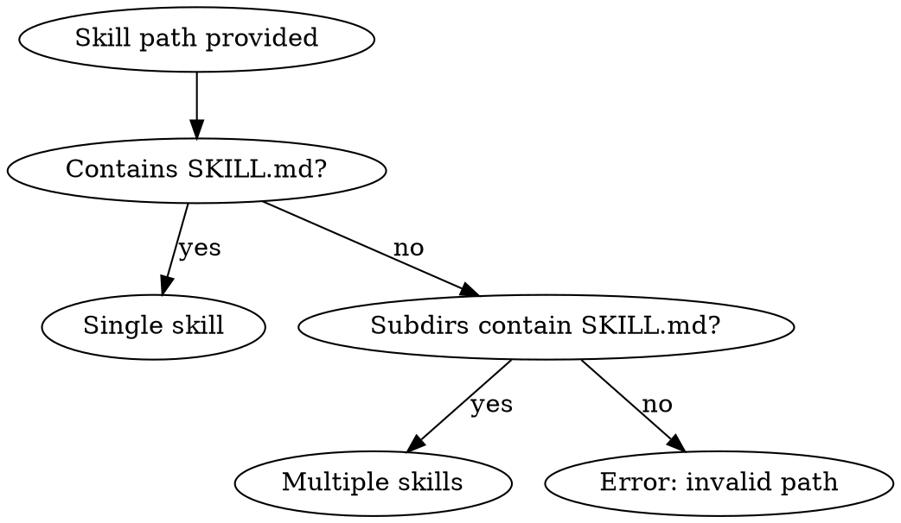

# Contribute Skill

将一个 skill 或 skill 目录提交到 yousa-skills 项目中，自动完成文件复制、README 元数据更新、双语 README 重新生成、git commit 和 PR 创建。

## 输入

用户提供以下之一：
- 一个 skill 目录路径（包含 `SKILL.md`）
- 一个包含多个 skill 子目录的目录路径

## 执行流程

### Step 1: 验证 Skill



对每个 skill：
1. 确认 `SKILL.md` 存在且包含有效的 YAML frontmatter（`name` 和 `description` 字段）
2. 读取 `name` 用于目录和清单定位；README 展示文案单独维护在 `docs/readme/skills.json`
3. 跳过 placeholder 文件（内容含 "placeholder" 或 "TODO" 的模板文件）

### Step 2: 复制到项目

```bash
# 对每个 skill，先清除旧目录再复制，避免合并冲突：
rm -rf skills/<skill-name>/
cp -r <skill-dir> skills/<skill-name>/
```

- 目标路径：`skills/<skill-name>/`（skill-name 取自 YAML frontmatter 的 `name` 字段）
- 如果目标已存在，提示用户确认是否覆盖；确认后先 `rm -rf` 再 `cp -r`，确保完整替换而非合并
- 清理 placeholder 文件：删除仅含模板内容的 `references/`、`scripts/`、`assets/` 文件

### Step 3: 更新清单并重新生成 README

更新 `docs/readme/skills.json`，把 skill 的 README 相关元数据加入单一来源。

规则：
- 如果该 skill 已存在于清单中，更新对应条目而非重复添加
- `description` 保持简洁，并分别维护英文/中文说明
- `README.md` 和 `README.zh-CN.md` 均为生成文件，不要手工编辑
- 如果 README 的页面文案或结构需要变化，修改 `docs/readme/templates/` 下的模板，而不是直接改生成产物

然后运行：

```bash
python3 scripts/render_readmes.py
```

确认两个 README 文件都已重新生成。

### Step 4: Git Commit

```bash
git add skills/<skill-name>/ docs/readme/skills.json README.md README.zh-CN.md
git commit -m "feat: add <skill-name> skill" -m "<one-line description>"
```

- 多个 skill 时，每个 skill 一个 commit，或合并为一个 commit（取决于用户偏好）
- 遵循项目的 Conventional Commits 格式

### Step 5: 创建 PR

```bash
git checkout -b feat/add-<skill-name>
git push -u origin feat/add-<skill-name>
gh pr create --title "feat: add <skill-name> skill" --body "..."
```

PR body 包含：
- Summary：skill 名称和一句话描述
- 新增文件列表
- 安装说明

## 注意事项

- 提交前确认当前工作目录是 yousa-skills 项目根目录
- 如果当前分支有未提交的更改，先提示用户处理
- 多个 skill 一起提交时，可以合并为一个 PR
