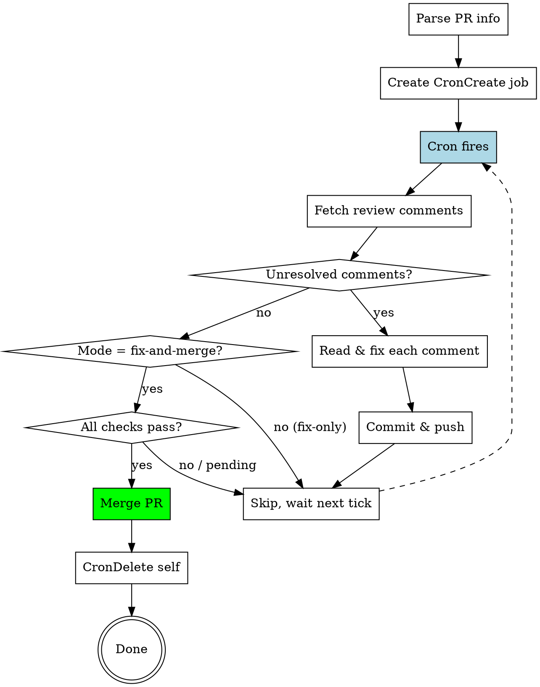

# PR Review Autofix

Create a local cron job that periodically scans an open PR for AI code review comments, auto-fixes them, and optionally merges when ready.

## When to Use

- User has an open PR with AI reviewers (Copilot, Codex, etc.) enabled
- User wants hands-off monitoring: fix review suggestions automatically, merge when clean
- User says "帮我盯着这个 PR" / "auto-fix review comments" / "自动处理 review"

## When NOT to Use

- PR needs human review approval (not just AI suggestions)
- User wants manual control over each fix
- Remote/cloud scheduling needed (use RemoteTrigger instead)

## Input

User provides:
1. **PR number or URL** (required) — e.g. `#6` or `https://github.com/owner/repo/pull/6`
2. **Mode** (optional, default: `fix-and-merge`)
   - `fix-and-merge`: auto-fix review comments AND merge when clean
   - `fix-only`: auto-fix review comments but do NOT merge
3. **Interval** (optional, default: `*/10` i.e. every 10 minutes)

## Core Workflow



## Step-by-Step

### Step 1: Parse PR Info

Extract from user input:
- `owner/repo` (from current git remote or PR URL)
- `pr_number`
- `branch` name (from `gh pr view {pr_number} --json headRefName`)

```bash
# From current repo
REMOTE_URL=$(git remote get-url origin)
# Extract owner/repo
OWNER_REPO=$(echo "$REMOTE_URL" | sed -E 's#.+github\.com[:/](.+)\.git$#\1#; s#.+github\.com[:/](.+)$#\1#')
# Get PR branch
BRANCH=$(gh pr view {pr_number} --json headRefName -q '.headRefName')
```

### Step 2: Create Local Cron

Use `CronCreate` with `durable: true` so the job survives session restarts.

**Parameters:**
- `cron`: `"*/10 * * * *"` (every 10 minutes, or user-specified)
- `durable`: `true`
- `recurring`: `true`

**Prompt template** (the prompt passed to CronCreate):

```
You are monitoring PR #{pr_number} on {owner_repo} (branch: {branch}).
Mode: {fix-and-merge | fix-only}

## Step 1: Fetch review comments

Run these commands to get all review data:

gh api repos/{owner_repo}/pulls/{pr_number}/comments
gh api repos/{owner_repo}/pulls/{pr_number}/reviews
gh pr view {pr_number} --json reviews,comments,state

If PR state is "MERGED" or "CLOSED", output "PR already closed/merged. Please run CronDelete to remove this job." and stop.

## Step 2: Identify actionable comments

Filter for comments that:
- Have a concrete code suggestion (look for ```suggestion blocks or specific change requests)
- Are from automated reviewers (copilot-pull-request-reviewer, chatgpt-codex-connector, etc.)
- Have NOT been addressed in a subsequent commit

Ignore:
- Summary/overview comments with no actionable change
- Comments already resolved
- Comments on files that no longer exist

## Step 3: Fix each actionable comment

For each actionable comment:
1. Read the file and line(s) referenced
2. Understand the suggested change
3. Apply the fix
4. Stage the change

After all fixes:
git checkout {branch}
git add -A
git commit -m "fix: address AI code review feedback"
git push origin {branch}

## Step 4: Merge decision (fix-and-merge mode only)

ONLY if mode is fix-and-merge AND no actionable comments were found in Step 2:

gh pr checks {pr_number}

- If all checks pass (or no checks configured): gh pr merge {pr_number} --merge
- If checks failing: report what's failing, do NOT merge

After successful merge, output: "PR #{pr_number} merged successfully. Please run CronDelete to remove this job."

## Step 5: Summary

Output a brief summary:
- Comments found / fixed count
- Whether PR was merged or why not
- Next action needed (if any)
```

### Step 3: Confirm to User

After creating the cron job, report:
- Job ID (for manual `CronDelete` later)
- Mode (fix-and-merge / fix-only)
- Interval
- 7-day auto-expiry reminder
- How to cancel: `CronDelete {job_id}`

## Quick Reference

| User says | Mode | Behavior |
|-----------|------|----------|
| "盯着 PR，有问题就修，没问题就合" | fix-and-merge | Fix + merge |
| "只修 review 问题，别合" | fix-only | Fix only, never merge |
| "auto-fix and merge PR #6" | fix-and-merge | Fix + merge |
| "帮我处理下这个 PR 的 review" | fix-and-merge | Fix + merge (default) |

## Common Mistakes

| Mistake | Prevention |
|---------|------------|
| Forgot `durable: true` — close terminal, job gone | Always set `durable: true` in CronCreate |
| PR already merged but cron still running | Prompt checks PR state first, reminds to CronDelete |
| Force-pushed over collaborator's work | Always use incremental commits, never force push |
| Fixed a "suggestion" that was just an overview comment | Filter: only fix comments with concrete code changes or ```suggestion blocks |
| Cron expired after 7 days, PR still open | Warn user about 7-day limit at creation time |
| Merged PR that needs human approval | Check `gh pr view --json reviewDecision` — only merge if approved or no review required |

## Limitations

- **Session-bound by default**: even with `durable: true`, requires a Claude Code session running locally. If machine sleeps/shuts down, cron pauses.
- **7-day auto-expiry**: recurring crons auto-delete after 7 days.
- **AI review only**: designed for automated reviewer suggestions. Human review comments may need manual judgment.
- **No conflict resolution**: if the fix creates a merge conflict, the push will fail and the job will report it for manual intervention.
